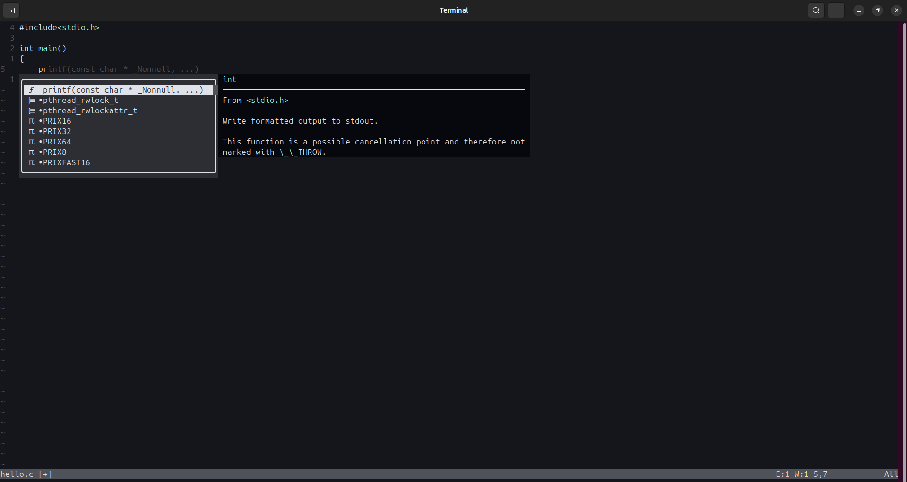

# nvim_attr

This repository contains the installation scripts for ***neovim, clangd, lazynvim*** the main goal is the availability of syntax suggestions and autocomplete for the C language when written using neovim editor.

## Requirements:

 - **System Architecture**: ***x86_64***,

 - **Operating System**: ***Linux(Suggested: **Ubuntu**)***,

 - **Shell**: ***Bash***,

 - **Packages**: ***wget, unzip, git***


## Installation:

### Clangd Installation:

1. First give execute permissions for the `clangd.sh` by executing the below command.

    ```bash
    chmod +x clangd.sh
    ```

2. Then, execute the installation script by running:

    ```bash
    ./clangd.sh
    ```

3. Add, the executable path to the `bashrc`:

    ```bash
    echo export PATH="$HOME/clangd-22.1.6/bin:$PATH" >> ~/.bashrc

    source ~/.bashrc
    ```

4. Test installation:

    ```bash
    clangd --version
    ```
----

### Neovim Installation & Setup:

1. First give execute permissions for the `nviminstall.sh` by executing the below command.

    ```bash
    chmod +x nviminstall.sh
    ```

2. Then, execute the installation script by running:

    ```bash
    ./nviminstall.sh
    ```

3. Add, the executable path to the `bashrc`:

    ```bash
    echo export PATH="$HOME/.local/bin:$PATH" >> ~/.bashrc

    source ~/.bashrc
    ```

4. Test installation:

    ```bash
    nvim --version
    ```
----

### LazyNeovim Installation & Setup:

1. First give execute permissions for the `lazynvim.sh` by executing the below command.

    ```bash
    chmod +x lazynvim.sh
    ```

2. Then, execute the installation script by running:

    ```bash
    ./lazynvim.sh
    ```

3. Open `nvim` and wait for the lazynvim packages to install.

----

### Autocomplete and Suggest Details:

> As we installed clangd it shows suggestions for the C language only.
> 
> Whenever, we type in a .c file a suggest popup appears which may cantain many possible syntax statements.
>
> Use `Tab` for to switch through all suggestions.
>
> `Shift + Tab` for previous suggestion.
> 
> Press `Enter` for  autocomplete.
>

-----

## Tool Demonstration:


## Attribution:

This project is inspired by and references the Neovim, clangd, lazynvim projects:

* [Neovim](https://github.com/neovim/neovim)
* [clangd](https://github.com/clangd/clangd)
* [lazynvim](https://github.com/folke/lazy.nvim)


This repository is not a fork and does not contain Neovim source code.

## Notice About What is included:

This repository contains the installation scripts for the ***clangd, neovim, and lazynvim***. The main goal of this repo is to provide a guided installation for the neovim with **Autocomplete** and **Suggest** features.


## License:

Check [LICENSE](./LICENSE) for more details.

----

<p align = "center"> <strong>Make sure to Star 🌟 the repo.</strong> </p>